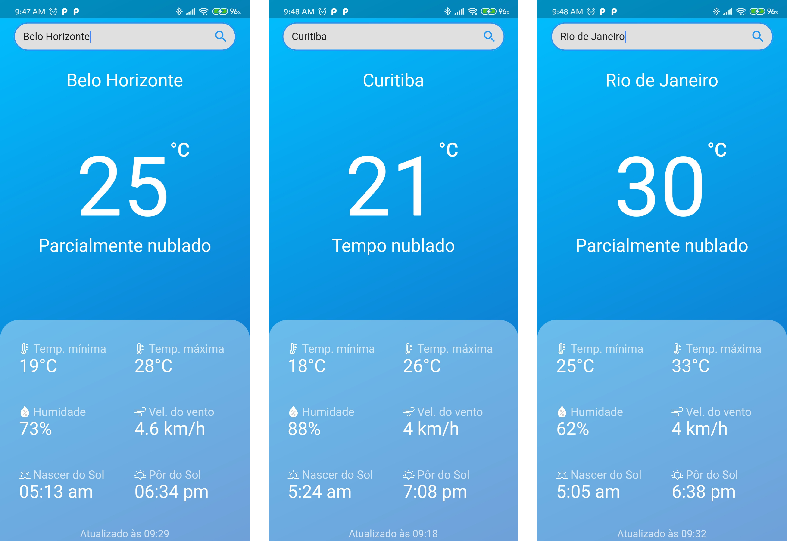

<h1 align="center"> Clima Tempo </h1>

    

## ✦ Projeto

O projeto consiste em um aplicativo mobile de previsão do tempo, que foi desenvolvido utilizando Flutter. O objetivo dese projeto é implementar os principais conceitos para a criação de um aplicativo com Flutter e utilizar dados fornecidos de uma API JSON fornecida pela [HG BRasil](https://hgbrasil.com/status/weather) 

---

O projeto foi desenvolvido, para fins didáticos, durante o curso de extensão "Desenvolvimento de Aplicativos com Flutter" do Centro Universitário Una – Campus Barreiro

